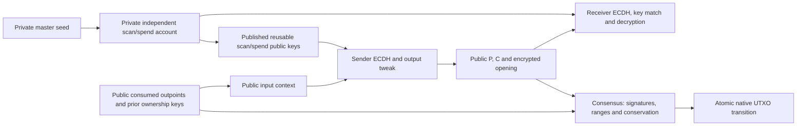

# Confidential native UTXOs: architecture review

Status: EXPERIMENTAL standalone Rust prototype with tests and baseline measurements. 2026-09-28. Not a production protocol or Bitcoin implementation.

This is a new project, independent of `../native-shielded-bitcoin`. No code or state from that project is inherited. No Bitcoin Core modifications are authorized by this design review alone.

## 1. Supply assumption resolved before implementation

The literal requirement to retain today's supply-audit guarantees conflicts with the proposed confidential accounting model. Today an auditor can add plaintext values. With Pedersen commitments, an auditor verifies computational binding and proof soundness instead. Public coinbase issuance does not by itself detect inflation caused by a broken commitment or proof implementation.

The user explicitly accepted **conditional cryptographic enforcement with documented additional assumptions** on 2026-09-28. This resolves the initial implementation gate. Independent plaintext supply auditability is not preserved. The conflict under a literal interpretation was recorded before implementation rather than silently changing the requirement.

Other gates: this direct replacement of value encoding requires a hard fork; receiver privacy is conditional, not absolute; recovery needs historical chain data and a discoverable account range. These must remain explicit rather than being hidden by implementation details.

## 2. What is a confidential UTXO?

An entry indexed by `(txid, vout)` in the consensus UTXO map, containing a tagged confidential amount commitment, a payment-specific x-only secp256k1 ownership key, creation height and coinbase status. Spending removes that exact entry; outputs create new entries. There is no membership tree, nullifier or second ledger.

Transparent outputs retain public satoshi values. Confidential outputs use `C = rG + vH`, with ordinary secp256k1 generator G and a separately specified value generator H whose discrete logarithm relative to G is unknown. This swaps the naming convention of the illustrative expression in the request; amounts multiply H throughout this project.

## 3. Concrete candidate transaction

All sizes below are a proposed simulator envelope, not Bitcoin wire compatibility. Canonical unsigned integers are little-endian; vectors have fixed u32 counts. Reject unknown versions, trailing bytes, over-limit counts and noncanonical encodings before allocation or cryptography.

```text
PUBLIC BASE BODY (txid = tagged hash of this canonical body)
  domain/version/network          ASCII CNU0[4], network u32 = 0x43505554
  inputs[]                        u32 count; each prev_txid[32], vout[u32]
  outputs[]                       count; output index is its array position
    transparent variant           type[1], amount[u64], ownership key[32]
    confidential variant          type[1], ownership key P[32], commitment C[33],
                                  encrypted opening[56]
  fee                             public u64 sats
  lock_height                     u32, absolute simulator height; sequences deferred

PUBLIC WITNESS (wtxid binds base body and all witness bytes)
  input signatures[]              u32 count; one BIP340 signature[64] per input
  output range proofs[]           u32 count; tag[1] then (if confidential):
                                  complement K[33], length[u32]+lower proof[4166],
                                  length[u32]+upper proof[4166]
  excess authorization            tag[1]; absent if blind excess zero, otherwise
                                  E[33], length[u32]+exact-zero proof[65]

ENCRYPTED OPENING (40 plaintext bytes + 16-byte AEAD tag)
  value                           u64 sats
  blinding scalar r               canonical scalar[32]

PRIVATE WALLET MATERIAL (never submitted to the validator)
  seed; account scan/spend secrets
  sender's aggregate input secret a; shared ECDH point S
  recovered amount v; opening r; output tweak t; spending secret p
```

The transparent simulator ownership variant is deliberately limited to key spends. Existing Bitcoin scripts are not modeled by pretending that every transparent input is a key. Core integration must retain existing script validation separately.

Receiver metadata lives in the base body so outpoints and signatures bind it. Proof witness bytes are committed by a block witness commitment in an eventual integration. Proof replacement can change wtxid, but not the output outpoint. Proof validity binds the relevant base-body statement. There is no txid/shared-secret circular dependency: derive receiving material from an input context before constructing outputs.



## 4. Ownership and reusable address

Use BIP340 ownership over the one-time x-only output key, with even-Y secret normalization when signing. Script-path spending is deferred. Calling this Taproot-style ownership does not make the confidential output current-format P2TR.

Candidate address: Bech32m with experimental HRP `cputest`, version byte 0 and two full compressed 33-byte public keys `(Bscan, Bspend)`. Reject invalid/infinite points, unknown versions, wrong network and excess payload. The resulting address exceeds ordinary Bech32's 90-character limit: an explicitly specified extended-length decoder is necessary, as in other dual-key address protocols. This is not a registered prefix or production address standard. No seed fingerprint, account index, shared xpub or label is encoded.

## 5. BIP352-inspired derivation, not BIP352 interoperability

For the minimal single-sender simulator, every input has a known key-spend private key. Lift each prior x-only ownership key to even Y, normalize the corresponding secret, and sum: `A = sum(Pinput)`, `a = sum(pinput)`. Reject zero a/infinite A for this sending construction; the underlying consensus need not prohibit other receiving protocols.

Define `ctx = tagged_hash("CNU/input/v0", network_u32 || version_u32(0) || input_count_u32 || canonical ordered input outpoints || compressed A)`. The protocol tag, complete ordered list and serialization differ from BIP352. Do not import its vectors as if they validate this construction. Distinct accepted transactions cannot reuse consumed outpoints on one chain; output position distinguishes destinations within a transaction. An RBF replacement with identical inputs can intentionally reuse receiving material; this is not a new independent payment.

Sender computes `S = a*Bscan`. Scanner retrieves the prior ownership keys from historical chain data and computes `S = bscan*A`. For confidential output index j, HKDF-SHA256 over compressed S uses ctx as salt and info `ASCII("CNU/v0/") || ASCII(label) || j_u32`. Labels are `ownership`, `metadata-key`, `metadata-nonce`. Hash ownership material with counter_u32 using tagged SHA256 `CNU/tweak/v0` into `[1,n-1]`; invalid or infinite `Bspend+tG` candidates are retried deterministically. Set P to its x coordinate. Receiver spend secret is `bspend+t`, normalized to even Y by BIP340 signing. All u32 encodings here are little-endian. Frozen regression vectors exist, but independent cross-implementation vectors remain necessary.

This retains aggregate input ECDH and receiver scan/spend separation, but changes eligible inputs, domains, counter indexing and ciphertext handling. Collaborative sending, general scripts and hardware-wallet ECDH proofs are unsupported, not silently solved. A compositional privacy review is still needed.

An explicit random ephemeral sender key is an alternative with easier script support, but is not selected here: unbound or reused ephemerals introduce additional reuse hazards and another public field. Input ECDH supplies transaction-specific material already available in the minimal model.

## 6. Scanning, encryption and recovery

For each account, compute one S per eligible transaction, then derive P for each confidential output index. Compare the x-only key before decrypting. No public view tag in V1: this avoids another linkability/filtering surface until scanning measurements justify it.

Encrypt `(v,r)` with AES-256-GCM-SIV. Derive a separate per-output 32-byte key and 12-byte nonce from S, ctx and j. Bind ctx, j, output type, P and C as associated data. Nonce-misuse resistance handles accidental reuse across conflicting replacements better than the initial ChaCha20-Poly1305 sketch; repeated data is still recognizable. Wallet RNGs must supply cryptographic random nonzero output blindings and independent private proof nonces. Deterministic RNGs are confined to test and benchmark callers.

After decryption enforce the amount range, canonical r and `commit(v,r)==C`. A scan key holder can detect receipts and read amounts/openings but cannot sign without the spend secret. Consensus cannot establish that a ciphertext is decryptable by its intended recipient; malformed metadata can burn a payment without inflating supply. Wallet construction must verify it locally.

Account derivation: BIP32 all-hardened `m / 836969' / 1' / account' / role'`, with role 0 scan and role 1 spend. This is an experimental namespace, not an allocated purpose. The prototype uses rust-bitcoin derivation and fails on an invalid child rather than aliasing a neighboring account; a complete interoperable skipped-child policy remains to be specified. BIP39 mnemonic UI is not implemented; if offered, it only maps mnemonic plus passphrase to a seed, and a missing passphrase is not recoverable.

Seed-only discovery cannot find arbitrarily sparse accounts in finite time. The prototype takes an explicit account count (up to 1,024), deriving indexes [0,count). Sequential account allocation with an automatic gap limit is a future wallet policy, not implemented. An unconditional guarantee for all arbitrary account indexes is UNSOLVED. A wallet birthday accelerates scanning but is not necessary with an archival chain source. Recovery validates and replays blocks, recovers openings and keys, and removes discovered outputs when their outpoints are spent. Consensus reorgs use undo; wallet reorg recovery replays the supplied canonical branch. Pruned nodes need historical blocks from an untrusted source checked against the canonical chain.

Use the same receiving construction for change. No extra audit or outgoing-recovery key is required for recovering current spendable funds. Recovering full outgoing recipient identity is a separate feature and is not promised by a seed-only UTXO rescan.

## 7. Conservation and monetary limits

Let M = 2,100,000,000,000,000 sats. Transparent amount v contributes `vH`; a confidential amount contributes C. Compute

`D = sum(input commitments) - sum(output commitments) - fee*H`.

The sender knows excess x = sum(input r) - sum(output r), with transparent r=0. Publish E=commit(0,x) and an exact-zero proof using the selected library. Verify the proof, then `sum(inputs)=sum(outputs)+fee*H+E`. For x=0 omit E and verify the direct tally. E is not an output. A nonzero value imbalance should make this infeasible under binding and proof soundness assumptions. Ownership signatures alone are not a replacement for this check.

This excess approach allows independent random output blindings; requiring a raw zero commitment tally without explaining blinding balance would be incomplete. The initial Schnorr excess sketch was replaced with a library exact-zero proof to avoid custom conversion between commitment and SEC1 point encodings. Composition remains subject to review.

Each confidential output needs a zero-knowledge proof of `0<=v<=M`. A generic 64-bit proof alone is insufficient. The prototype uses two fixed 52-bit proofs, one for C and one for published complement K, with openings `(v,r)` and `(M-v,-r)`. Verify `C+K=M*H` and both ranges [0,2^52-1]. Together they establish the desired interval, since these integer ranges are tiny relative to the group order. Reject infinity commitments; v=0 and v=M work with nonzero r. Canonical proof header checks reject wider ranges before the dependency's exclusive-range conversion can overflow.

Cap inputs and outputs at 4,096 each, proofs at 5,134 bytes before their stricter canonical checks, and transactions/blocks at 4,000,000 serialized bytes. There is no witness discount. These bound proof work but are research constants, not calibrated mainnet budgets. Even 4,096 52-bit values are far below the group order; modular wraparound cannot stand in for integer balance. Fees and transparent values use checked arithmetic and [0,M] bounds. Transparent simulated coinbase issuance initializes the induction; outputs are range constrained and each transaction conserves integer value conditionally on cryptographic security. Coinbase maturity is 100 blocks; subsidy starts at 50 BTC and halves every 210,000 simulated heights. Height zero has no spendable genesis coin; issuance remains below the Bitcoin upper bound.

## 8. Validation and state lifecycle

Parse with strict size bounds; reject duplicate inputs; fetch every input from the UTXO map; enforce maturity and absolute height locks; validate canonical keys/commitments; check ranges, input signatures and excess; validate public fee; then commit atomically. This research implementation stages a cloned UTXO map and journals original spent coins and created outpoints for undo, including in-block child spends. Failure leaves state unchanged. Replay and live output overwrites fail. PoW, chain selection, relative locks, general script execution, networking and a persistent database are not modeled.

Proof validation is a consensus primitive. No proof opcode is needed for the minimal key-spend model. Optional wallet indexes may cache scan data but cannot authorize spends or define balances. Rebuilding consensus requires the chain alone, never the seed; rebuilding a wallet requires its seed and historical chain data.

## 9. Boundaries and unsolved privacy

T->C reveals funding amounts and total confidential output value net of public change/fee. A single confidential output can therefore have an exactly inferable value. C->C offers commitment hiding, not protection against all amount inference: a known input total and one output reveal that output; visible graph constraints can propagate knowledge. C->T reveals withdrawals. Public fees, timing, input co-spends and change heuristics remain observable.

Distinct payment keys do not prove unlinkability. A sender knows whom it paid; a scan-key holder can link incoming outputs; recipient disclosures and later consolidation can link payments. Required privacy statements must be interpreted within the explicit observer model in PRIVACY_MODEL.md.

## 10. Consensus delta and soft-fork gate

Current amounts sit outside script. A new witness version alone cannot replace plaintext accounting. The direct tagged-amount proposal changes parsing, coin storage, transaction value checks, signature messages and proof validation: a hard fork candidate.

Counterexample to a naive soft fork: storing confidential value under legacy nValue=0 and later withdrawing 1 BTC yields legacy inputs of zero and a positive output. An old node rejects the transaction irrespective of new witness rules. Keeping a positive carrier amount instead preserves a public accounting constraint and does not implement the requested direct value replacement. Restricted reserve/extension constructions would need separate analysis and are outside this minimal native-outpoint design. This is not a universal impossibility theorem for every imaginable soft-fork privacy construction.

See CONSENSUS_PREFLIGHT.md for the initial compatibility review and BITCOIN_CONSENSUS_DELTA.md for the post-prototype mapping. This document describes the standalone design. The subsequent modified Core lab, including its different wire encoding and native chainstate handling, is documented in [CORE_INTEGRATION.md](CORE_INTEGRATION.md).

## 11. Evidence and remaining work

PROVEN here means an algebraic implication under stated premises, not a security proof of the full protocol. ASSUMED: ECDH security, generator independence, signature unforgeability and range-proof soundness. EXPERIMENTAL: entire protocol composition, wire format and wallet. UNSOLVED: unchanged plaintext supply audit, unrestricted finite seed discovery, production DoS budgets, full unlinkability proof and deployment.

The Rust workspace implements the flow with adversarial tests, frozen regression vectors and measured baseline costs. These do not establish production security, acceptable decentralization costs or a formal unlinkability result. See CRYPTOGRAPHY.md, DECISIONS.md, VALIDATION_PLAN.md and BENCHMARKS.md.

## Primary references

- [BIP352](https://bips.dev/352/): receiver derivation reference, not claimed interoperability.
- [BIP32](https://bips.dev/32/), [BIP340](https://bips.dev/340/), [BIP341](https://bips.dev/341/).
- [Core transaction representation](https://github.com/bitcoin/bitcoin/blob/master/src/primitives/transaction.h) and [input validation](https://github.com/bitcoin/bitcoin/blob/master/src/consensus/tx_verify.cpp), consulted 2026-09-28. Moving references must be pinned for integration work.
- [secp256k1-zkp](https://github.com/BlockstreamResearch/secp256k1-zkp) and its [Rust bindings](https://github.com/BlockstreamResearch/rust-secp256k1-zkp).
- [Bulletproofs authors' resource](https://crypto.stanford.edu/bulletproofs/).
